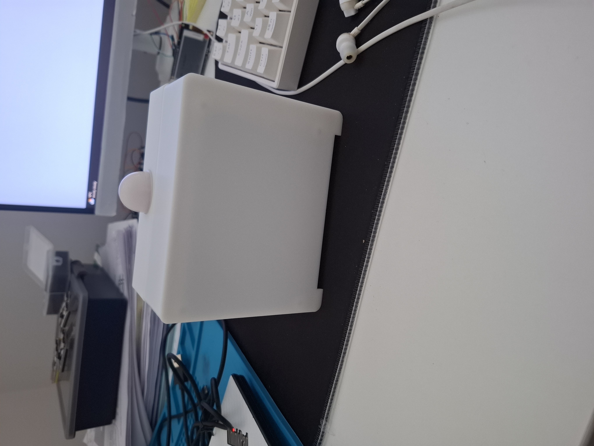

# Smart Home Panel

## Overview

The **Smart Home Panel** is an embedded IoT system designed to monitor room conditions, detect human presence, display live sensor data on a touchscreen interface, and trigger basic smart home automation.

The project combines:

- Environmental sensing
- Human presence detection
- Local touchscreen interaction
- Cloud telemetry using ThingsBoard
- MQTT-based automation
- Experimental Matter-over-Thread smart home integration

This project was developed as part of my **3rd Year Computer Engineering project** and demonstrates practical experience with embedded systems, IoT platforms, PCB design, cloud dashboards, and modern smart home technologies.

---

---

## Background: Key Technologies

### What is ThingsBoard?

**ThingsBoard** is the IoT platform used as the backend for this project. It receives telemetry from the Smart Panel over MQTT and displays the data using dashboards.

In this project, ThingsBoard is used for:

- Viewing live sensor data remotely
- Creating dashboards for the Smart Panel and light device
- Triggering alarms when human presence is detected
- Sending email alerts using SMTP
- Running rule chains for automation
- Sending RPC commands to control the ESP32-S3 light device

This allowed the project to have cloud monitoring and automation without needing to build a custom backend from scratch.

---

### What is MQTT?

**MQTT** is a lightweight messaging protocol commonly used in IoT systems. It works using a publish/subscribe model.

In this project:

- The Smart Panel publishes sensor telemetry to ThingsBoard
- ThingsBoard receives and processes the data
- The light device receives RPC control messages from ThingsBoard

MQTT was chosen because it is efficient, simple to use with ESP32 devices, and well supported by ThingsBoard.

---

### What is Thread?

**Thread** is a low-power wireless communication protocol designed for smart home devices. It is based on IEEE 802.15.4 and allows devices to form a mesh network.

Thread is useful because:

- It is designed for low-power smart home devices
- Devices can communicate in a mesh network
- It does not rely only on Wi-Fi
- It is commonly used with Matter devices

In this project, Thread was explored using an ESP32-H2 Matter light device and an ESP32-C6 Thread Border Router.

---

### What is Matter?

**Matter** is a smart home standard designed to make devices work across different ecosystems, such as Amazon Alexa, Google Home, Apple Home, and SmartThings.

The goal of Matter is to reduce the problem of smart home devices being locked to one brand or ecosystem.

In this project, Matter was explored using Espressif’s ESP-Matter SDK. The ESP32-H2 was configured as a Matter-over-Thread light device and commissioned through Amazon Alexa.

---

### Why is a Thread Border Router needed?

A **Thread Border Router** connects the Thread network to an IP-based network such as Wi-Fi or Ethernet.

Thread devices do not connect directly to a normal Wi-Fi router. They communicate over the Thread mesh network, so a border router is required to bridge communication between the Thread network and the wider network.

In this project, the ESP32-C6 was used as a Thread Border Router. Its role was to allow the ESP32-H2 Matter device to communicate with smart home controllers such as Amazon Alexa.

---

### Do I need Amazon Alexa for Thread or Matter?

Amazon Alexa is not strictly required to use Matter or Thread, but it can act as a **Matter controller**.

A Matter controller is responsible for commissioning, managing, and controlling Matter devices.

For this project, Amazon Alexa was used because it was available and provided a practical way to test Matter device commissioning and control.

Other possible Matter controllers include:

- Google Home
- Apple Home
- SmartThings
- Raspberry Pi with Matter controller software
- ESP32-based Matter controller examples

In the current prototype, Alexa was used to confirm that the ESP32-H2 Matter light device could be commissioned and controlled successfully.

---

## Project Aim

The aim of this project was to design and build a smart home panel capable of:

- Measuring room temperature, humidity, pressure, light level, and air quality
- Detecting human presence using mmWave radar
- Displaying live readings on a local LVGL touchscreen UI
- Sending telemetry to a ThingsBoard server using MQTT
- Controlling a separate ESP32-S3 light device using ThingsBoard RPC
- Demonstrating Matter-over-Thread device commissioning using an ESP32-H2 and ESP32-C6 Thread Border Router

---

## System Architecture

The system is built around a central **ESP32-S3 Smart Panel**. This device reads sensor data, updates the local touchscreen interface, and sends telemetry to a ThingsBoard server over Wi-Fi using MQTT.

ThingsBoard is used to store telemetry, display dashboards, generate alarms, send email notifications, and trigger automation rules. A separate ESP32-S3 light device subscribes to RPC commands from ThingsBoard and can be controlled automatically based on human presence.

A secondary Matter-over-Thread subsystem was also tested using an ESP32-H2 as a Matter light device and an ESP32-C6 as a Thread Border Router.

---

## Main Components

| Component | Purpose |
|---|---|
| ESP32-S3 | Main controller for the Smart Panel |
| ESP32-H2 Zero | Matter-over-Thread coprocessor / light device |
| ESP32-C6 | Thread Border Router |
| ILI9488 / ST7796 TFT Touchscreen | Local graphical user interface |
| AHT20 | Temperature and humidity sensing |
| BMP280 | Atmospheric pressure sensing |
| BH1750 | Ambient light sensing |
| SGP40 | Air quality / VOC index sensing |
| RD-03D mmWave Radar | Human presence detection |
| ThingsBoard | IoT dashboard, telemetry storage, alarms, and rule chains |
| ESP32-S3 Light Device | Remote light device controlled using RPC |

---

## What the System Currently Does

### Smart Panel

The Smart Panel acts as the main sensor hub. It reads environmental values, detects human presence, displays live data on the touchscreen, and sends telemetry to ThingsBoard.

Current measured values include:

- Room temperature
- Humidity
- Atmospheric pressure
- Light level
- Air quality / VOC index
- Human presence

The interface was built using **LVGL**, allowing the panel to show live readings, detail screens, and alarm controls.

---

### Human Presence Detection

Human presence is detected using an **RD-03D mmWave radar sensor**. This was chosen instead of a traditional PIR sensor because mmWave sensors can detect small movements, including micro-movements from a stationary person.

This makes the system more suitable for smart home automation, where a person may be sitting still but should still be detected as present.

---

### ThingsBoard Dashboard

ThingsBoard is used as the IoT backend for the project. The Smart Panel sends telemetry to ThingsBoard using MQTT.

ThingsBoard provides:

- Live dashboards
- Sensor data visualisation
- Alarm generation
- Email alerts
- Rule chain automation
- RPC control of the light device

A rule chain was created so that when human presence is detected, ThingsBoard sends an RPC command to the ESP32-S3 light device to turn the light on. When presence is no longer detected, the light can be turned off.

---

### Light Device and Thread Border Router

A separate ESP32-S3 light device was used to demonstrate remote actuation through ThingsBoard RPC commands.

The project also explores Matter-over-Thread using:

- ESP32-H2 Zero as a Matter light device
- ESP32-C6 as a Thread Border Router
- Amazon Alexa as a Matter controller

The Matter subsystem currently works as a separate demonstration. Full communication between the ESP32-S3 Smart Panel and ESP32-H2 Matter coprocessor is planned as future work.

---

## Hardware Design

A custom PCB was designed to connect the ESP32-S3, sensors, display, buzzer, buck converter power circuitry, and expansion headers.

The system uses several communication protocols:

| Protocol | Used For |
|---|---|
| SPI | TFT display and touch controller |
| I2C | AHT20, BMP280, BH1750, SGP40 sensors |
| UART | RD-03D radar and ESP32-H2 coprocessor communication |
| Wi-Fi | MQTT communication with ThingsBoard |
| Thread | Matter smart home communication |

---

## Enclosure Design

### Smart Panel Enclosure

The Smart Panel enclosure was designed to house the touchscreen, ESP32-S3, sensors, radar module, buzzer, and internal wiring.

The enclosure was designed as a prototype and would need further refinement for a more professional or manufacturable version.

### Light / OTBR Enclosure

A separate enclosure was designed for the light device and Thread Border Router hardware. This helped separate the main sensor panel from the smart home actuation and Thread testing hardware.

---
