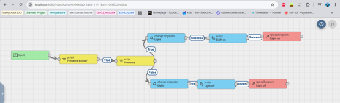

# Smart Home Panel

  

  <em>Figure 1: Smart Home Panel prototype revision</em>

---

## Table of Contents

- [Overview](#overview)
- [Problem Statement and Motivation](#problem-statement-and-motivation)
- [Project Aim](#project-aim)
- [System Architecture](#system-architecture)
- [System Functionality](#system-functionality)
- [System Sequence Diagram](#system-sequence-diagram)
- [Hardware Design](#hardware-design)
- [Software Design](#software-design)
- [ThingsBoard Rule Chains](#thingsboard-rule-chains)
- [Enclosure Design](#enclosure-design)
- [Current Project Status](#current-project-status)
- [Future Work](#future-work)

---

## Overview

The **Smart Home Panel** is an embedded IoT system designed to monitor room conditions, detect human presence, display live sensor data on a touchscreen interface, and trigger basic smart home automation.

The project combines environmental sensing, mmWave human presence detection, a local LVGL touchscreen interface, cloud telemetry using ThingsBoard, MQTT-based automation, and basic Matter-over-Thread smart home integration.

This project was developed as part of my **3rd Year Computer Engineering project** and demonstrates practical experience with embedded systems, PCB design, sensor integration, IoT platforms, cloud dashboards, and smart home technologies.

---

## Problem Statement and Motivation

Many smart home lighting systems use PIR motion sensors, which mainly detect changes in infrared radiation caused by movement. This can be unreliable when someone is sitting still. For example, while I was studying in the library, I was sitting behind a personal study desk and the lights suddenly turned off. After looking into it, I realised this was likely due to how PIR sensors work and how they were positioned in the room.

This personally offended me. I thought to myself, “even the motion sensors do not notice me anymore.” Jokes aside, this gave me the idea to work on a project that solves a problem I experienced while also improving my understanding of room monitoring systems.

Before choosing mmWave, I considered a few other approaches. One idea was to use microcontrollers with ultrasonic sensors to measure the distance between a desk and chair. If the distance was below a certain threshold, the system could assume someone was sitting there. However, this would be difficult to make reliable because ultrasonic sensors can be affected by clothing, soft materials, object placement, and room layout. I also considered load cells, but the cost per unit and daily wear would make that approach less practical.

After some research, I discovered mmWave radar sensors. In simple terms, these sensors send out high-frequency radio waves and analyse the reflections that return. Using changes in the reflected signal, such as Doppler shift and phase changes, they can detect small micro-movements from a stationary person, such as breathing or slight body movement. This made mmWave sensing a more practical option for presence detection with wider coverage compared to PIR, ultrasonic sensors, or load cells.

The proposed solution was a Smart Home Panel that uses mmWave human presence detection instead of relying only on PIR motion detection. This makes the system more suitable for presence-based lighting, room monitoring, and basic alarm features.

This project also gave me the opportunity to combine several technologies into one working embedded system, including sensor integration, touchscreen UI development, web-based dashboards, MQTT communication, ThingsBoard rule chains, and Matter-over-Thread experimentation. This year I wanted to gain more exposure to different technolgies available. I decided to keep the main features inside one Smart Panel device to stay realistic with the project timeframe and make the system easier to prototype.

---

## Project Aim

The aim of this project was to design and build a prototype Smart Home Panel that can monitor room conditions, detect human presence, display live readings locally, and use the collected data to trigger basic smart home automation.

The system was designed to combine environmental sensing, mmWave presence detection, a touchscreen UI, ThingsBoard cloud telemetry, MQTT communication, RPC light control, and experimental Matter-over-Thread integration.

---

## Identified Project Requirements

| Requirement | Description |
|---|---|
| Human presence detection | Detect whether a person is present in the room using an RD-03D mmWave radar sensor. |
| Environmental monitoring | Measure temperature, humidity, pressure, light level, and air quality. |
| Local display | Show live sensor readings on a touchscreen interface using LVGL. |
| Remote telemetry | Send sensor data to ThingsBoard using MQTT so the readings can be viewed remotely. |
| Presence-based light control | Use ThingsBoard rule chains to send RPC commands to a separate ESP32-S3 light device. |
| Alerts and notifications | Generate an alarm and send an email alert when human presence is detected. |
| Smart home experimentation | Demonstrate Matter-over-Thread commissioning using an ESP32-H2 Matter device and an ESP32-C6 Thread Border Router. |
| Prototype integration | Keep the main monitoring features inside one Smart Panel device to reduce complexity and make the system easier to test. |

---

## Functional Summary

The Smart Panel reads room sensor values, checks for human presence, updates the touchscreen UI, and publishes telemetry to ThingsBoard. ThingsBoard then processes the telemetry using rule chains. If presence is detected, the system can turn on the light device and send an email alert. If presence is no longer detected, the light can be turned off automatically.

---

## System Architecture

  

  <em>Figure 2: High-level system architecture</em>

The system is built around a central **ESP32-S3 Smart Panel**. This device reads sensor data, updates the local touchscreen interface, and sends telemetry to a ThingsBoard server over Wi-Fi using MQTT.

ThingsBoard is used to store telemetry, display dashboards, generate alarms, send email notifications, and trigger automation rules. A separate ESP32-S3 light device subscribes to RPC commands from ThingsBoard and can be controlled automatically based on human presence detection.

A secondary Matter-over-Thread subsystem was also tested using an ESP32-H2 as a Matter light device and an ESP32-C6 as a Thread Border Router. This Matter subsystem currently works as a separate demonstration, with full integration planned as future work.

## System Functionality

### Smart Panel

  

  <em>Figure 3: Smart Panel front view during testing</em>

The Smart Panel acts as the main sensor hub. It reads environmental values, detects human presence, displays live data on the touchscreen, and sends telemetry to ThingsBoard.

Current measured values include:

- Room temperature
- Humidity
- Atmospheric pressure
- Light level
- Air quality / VOC index
- Human presence

The interface was built using **LVGL**, allowing the panel to show live readings, detail screens, and alarm controls.

---

### Human Presence Detection

*Demo video yet to come (Once I get my project back from review)

  

  <em>Figure 4: Room testing of the Smart Panel and mmWave presence detection</em>

Human presence is detected using an **RD-03D mmWave radar sensor**. This was chosen instead of a traditional PIR sensor because mmWave sensors can detect small movements, including micro-movements from a stationary person.

This makes the system more suitable for smart home automation, where a person may be sitting still but should still be detected as present.

---

### ThingsBoard Dashboard

  

  <em>Figure 5: ThingsBoard dashboard overview</em>

  

  <em>Figure 6: ThingsBoard Smart Panel sensor dashboard</em>

  

  <em>Figure 7: ThingsBoard light device dashboard</em>

ThingsBoard is used as the IoT backend for the project. The Smart Panel sends telemetry to ThingsBoard using MQTT.

ThingsBoard provides:

- Live dashboards
- Sensor data visualisation
- Alarm generation
- Email alerts
- Rule chain automation
- RPC control of the light device

A rule chain was created so that when human presence is detected, ThingsBoard sends an RPC command to the ESP32-S3 light device to turn the light on. When presence is no longer detected, the light automatically turns off. The light device can be manually turned off using the light device dashboard if the lights were left on due to false presence detection from a pet for example. 

---

### Light Device and Thread Border Router

  

  <em>Figure 8: Thread Border Router and light device testing</em>

A separate ESP32-S3 light device was used to demonstrate remote actuation through ThingsBoard RPC commands.

The project also explores Matter-over-Thread using:

- ESP32-H2 Zero as a Matter light device
- ESP32-C6 as a Thread Border Router
- Amazon Alexa as a Matter controller

The Matter subsystem currently works as a separate demonstration. Full communication between the ESP32-S3 Smart Panel and ESP32-H2 Matter coprocessor is planned as future work.

---

## System Sequence Diagram

  

  <em>Figure 9: Smart Panel system sequence diagram</em>

The sequence diagram shows how the Smart Panel communicates with the sensors, mmWave radar, ThingsBoard, the rule chain, the light device, and the SMTP email service.

The Smart Panel does not directly control the light. Instead, it sends telemetry to ThingsBoard. The ThingsBoard rule chain then decides whether the light should turn on or off and whether an email alert should be sent.

---

## Hardware Design

  

  <em>Figure 10: Smart Panel PCB</em>

  

  <em>Figure 11: Smart Panel schematic</em>

  

  <em>Figure 12: Smart Panel PCB layout</em>

A custom PCB was designed to connect the ESP32-S3, display, sensors, buzzer, buck converter power circuitry, and expansion headers. The PCB helped reduce wiring complexity compared to the early breadboard prototype and made the project closer to a complete embedded system.

### Main Components

| Component | Purpose |
|---|---|
| ESP32-S3 | Main controller for the Smart Panel |
| ESP32-H2 Zero | Matter-over-Thread coprocessor / light device |
| ESP32-C6 | Thread Border Router |
| ILI9488 / ST7796 TFT Touchscreen | Local graphical user interface |
| AHT20 | Temperature and humidity sensing |
| BMP280 | Atmospheric pressure sensing |
| BH1750 | Ambient light sensing |
| SGP40 | Air quality / VOC index sensing |
| RD-03D mmWave Radar | Human presence detection |
| ThingsBoard | IoT dashboard, telemetry storage, alarms, and rule chains |
| ESP32-S3 Light Device | Remote light device controlled using RPC |

### Communication Interfaces

| Protocol | Used For |
|---|---|
| SPI | TFT display and touch controller |
| I2C | AHT20, BMP280, BH1750, and SGP40 sensors |
| UART | RD-03D radar and ESP32-H2 coprocessor communication |
| Wi-Fi | MQTT communication with ThingsBoard |
| Thread | Matter smart home communication |

---

## Software Design

The Smart Panel firmware was designed around a **non-blocking service-loop approach**. Instead of using long `delay()` calls, the main loop repeatedly updates each subsystem when it is due to run. This keeps the touchscreen responsive while the ESP32-S3 reads sensors, checks the mmWave radar, updates alarm logic, maintains Wi-Fi/MQTT communication, and sends telemetry to ThingsBoard.

The project does not currently use a custom RTOS task structure. Although the ESP32 runs on FreeRTOS internally, the application logic is mainly organised as repeated service functions inside the Arduino `loop()`. This approach kept the prototype easier to develop and debug.

A future version could separate the display, sensor reading, MQTT communication, and alarm handling into dedicated FreeRTOS tasks. The firmware is also planned to be modularised into separate files for display handling, sensor services, cloud communication, shared data, configuration, and secrets.

### Firmware Flowchart

  

  <em>Figure 13: Smart Panel firmware flowchart</em>

### State Chart

  

  <em>Figure 14: Smart Panel state chart</em>

---

## ThingsBoard Rule Chains

The rule chains handle the cloud-side automation. When the Smart Panel sends new telemetry, ThingsBoard checks the human presence value. If presence is detected, the rule chain can create an alarm, send an email alert, and send an RPC command to turn on the light device. If no presence is detected, the light can be turned off.

  

  <em>Figure 15: ThingsBoard root rule chain</em>

  

  <em>Figure 16: ThingsBoard light control rule chain</em>

  

  <em>Figure 17: ThingsBoard alarms and SMTP email rule chain</em>

---

## Enclosure Design

### Smart Panel Enclosure

  

  <em>Figure 18: Smart Panel enclosure design</em>

The Smart Panel enclosure was designed to house the touchscreen, ESP32-S3, sensors, radar module, buzzer, and internal wiring. The current enclosure is a prototype and would need further refinement for a more professional or manufacturable version.

### Light / OTBR Enclosure

  

  <em>Figure 19: Light device and Thread Border Router enclosure design</em>

A separate enclosure was designed for the light device and Thread Border Router hardware. This helped separate the main sensor panel from the smart home actuation and Thread testing hardware.

---

## Current Project Status

| Requirement | Status |
|---|---|
| Sensor monitoring | Working |
| Human presence detection | Working |
| Touchscreen UI | Working |
| MQTT telemetry to ThingsBoard | Working |
| ThingsBoard dashboards | Working |
| ThingsBoard RPC light control | Working |
| Email alerts through SMTP | Working |
| Matter-over-Thread light commissioning | Partially working |
| ESP32-S3 to ESP32-H2 communication | Future work |
| Final enclosure refinement | Future work |
| Fully modular firmware | Future work |

---

## Future Work

Planned improvements include:

- Reliability and quality of the current system/ finding issues
- Add UART communication between the ESP32-S3 and ESP32-H2
- Send Smart Panel sensor states to the Matter subsystem
- Improve the LVGL interface design
- Add Wi-Fi setup directly from the touchscreen
- Refactor the firmware into cleaner modules
- Improve the PCB layout and power design
- Refine the enclosure
- Explore deeper Alexa, Google Home, or ESP RainMaker integration
- Add more smart home features such as voice control or additional sensors

---
