# Smart Home Panel

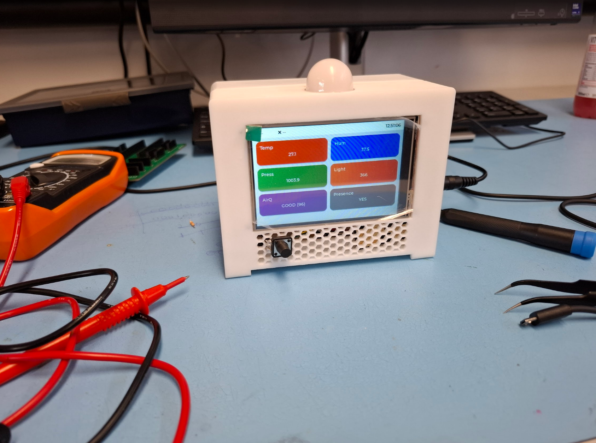

## Problem Statement and Motivation

Many smart home lighting systems use PIR motion sensors, which mainly detect changes in infrared radiation caused by movement. This can be unreliable when a person is sitting still, for example while studying or working, because the system may incorrectly assume the room is empty and turn the lights off.

This project explores a more reliable room-monitoring system using mmWave human presence detection. Unlike PIR sensors, mmWave radar can detect small movements, including micro-movements from a stationary person. This makes it more suitable for presence-based lighting, room monitoring, and basic alarm features.

The project also provided an opportunity to combine several areas of Computer Engineering, including embedded programming, PCB design, sensor integration, touchscreen UI development, MQTT communication, ThingsBoard dashboards, and Matter-over-Thread smart home experimentation.

## Overview

The **Smart Home Panel** is an embedded IoT system designed to monitor room conditions, detect human presence, display live sensor data on a touchscreen interface, and trigger basic smart home automation.

Currently the project combines:

- Environmental sensing
- Human presence detection
- Local touchscreen interaction
- Cloud telemetry using ThingsBoard
- MQTT-based automation integrated with Thingsboard Rule Chains
- Basic Matter-over-Thread smart home integration (Work in progress)

---

---

## Project Aim

The aim of this project was to design and build a smart home panel capable of:

- Measuring room temperature, humidity, pressure, light level, and air quality
- Detecting human presence using mmWave radar
- Displaying live readings on a local LVGL touchscreen UI
- Sending telemetry to a ThingsBoard server using MQTT
- Controlling a separate ESP32-S3 light device using ThingsBoard RPC
- Demonstrating Matter-over-Thread device commissioning using an ESP32-H2 and ESP32-C6 Thread Border Router

---

## System Architecture

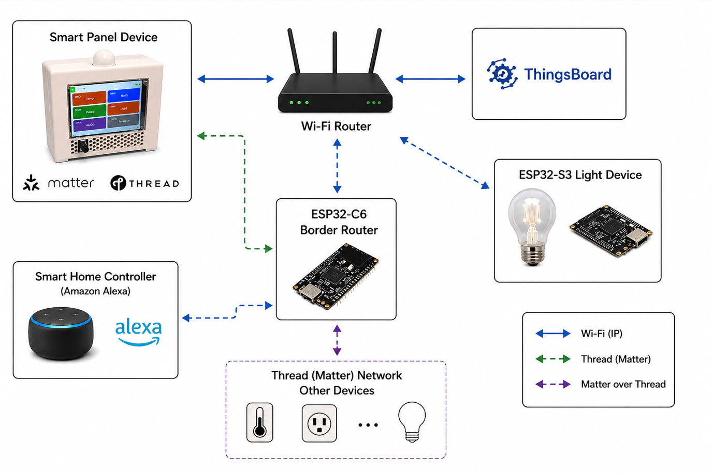

The system is built around a central **ESP32-S3 Smart Panel**. This device reads sensor data, updates the local touchscreen interface, and sends telemetry to a ThingsBoard server over Wi-Fi using MQTT.

ThingsBoard is used to store telemetry, display dashboards, generate alarms, send email notifications, and trigger automation rules. A separate ESP32-S3 light device subscribes to RPC commands from ThingsBoard and can be controlled automatically based on human presence.

A secondary Matter-over-Thread subsystem was also tested using an ESP32-H2 as a Matter light device and an ESP32-C6 as a Thread Border Router.

---

## What the System Currently Does

### Smart Panel

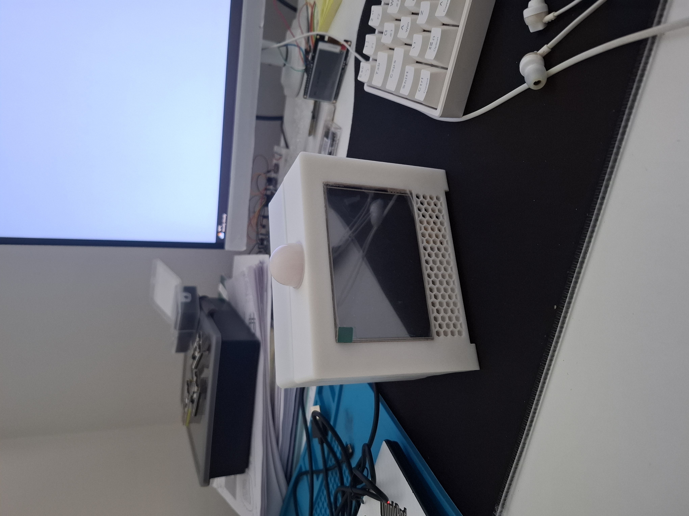

The Smart Panel acts as the main sensor hub. It reads environmental values, detects human presence, displays live data on the touchscreen, and sends telemetry to ThingsBoard.

Current measured values include:

- Room temperature
- Humidity
- Atmospheric pressure
- Light level
- Air quality / VOC index
- Human presence

The interface was built using **LVGL**, allowing the panel to show live readings, detail screens, and alarm controls.

---

### Human Presence Detection

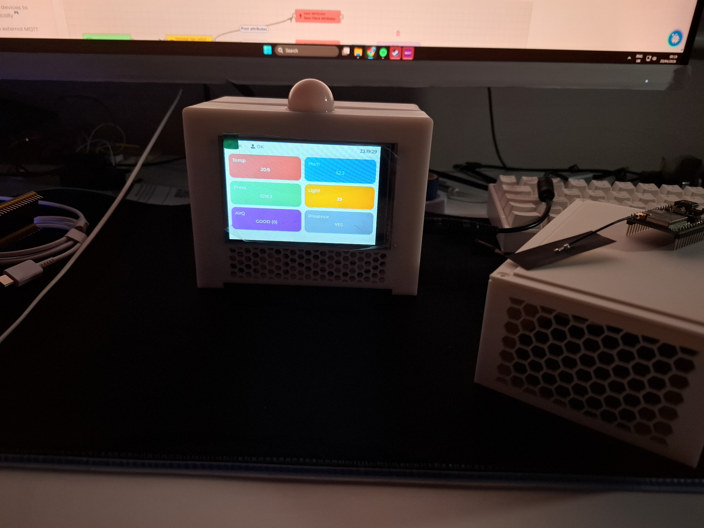

Human presence is detected using an **RD-03D mmWave radar sensor**. This was chosen instead of a traditional PIR sensor because mmWave sensors can detect small movements, including micro-movements from a stationary person.

This makes the system more suitable for smart home automation, where a person may be sitting still but should still be detected as present.

---

### ThingsBoard Dashboard

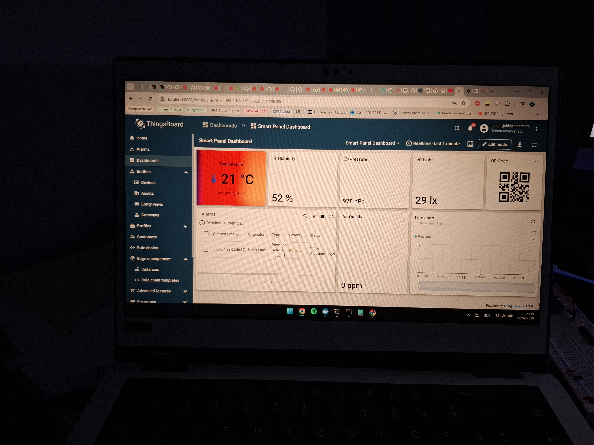

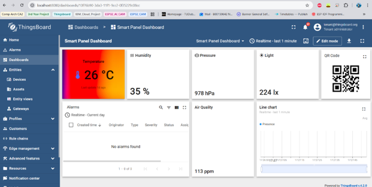

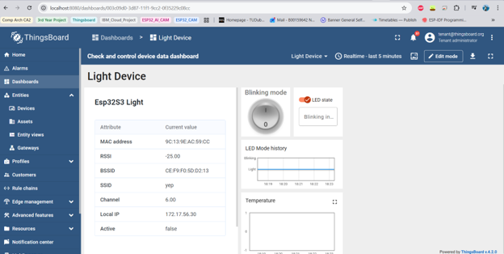

ThingsBoard is used as the IoT backend for the project. The Smart Panel sends telemetry to ThingsBoard using MQTT.

ThingsBoard provides:

- Live dashboards
- Sensor data visualisation
- Alarm generation
- Email alerts
- Rule chain automation
- RPC control of the light device

A rule chain was created so that when human presence is detected, ThingsBoard sends an RPC command to the ESP32-S3 light device to turn the light on. When presence is no longer detected, the light can be turned off.

---

### Light Device and Thread Border Router

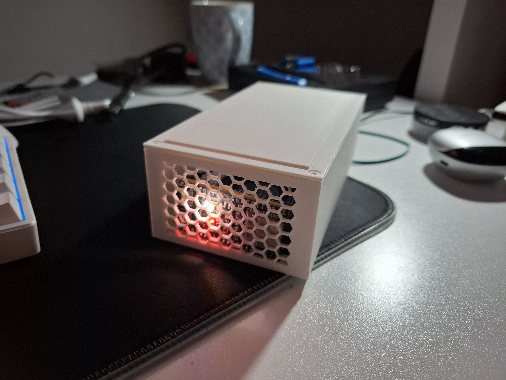

A separate ESP32-S3 light device was used to demonstrate remote actuation through ThingsBoard RPC commands.

The project also explores Matter-over-Thread using:

- ESP32-H2 Zero as a Matter light device
- ESP32-C6 as a Thread Border Router
- Amazon Alexa as a Matter controller

The Matter subsystem currently works as a separate demonstration. Full communication between the ESP32-S3 Smart Panel and ESP32-H2 Matter coprocessor is planned as future work.

---

## System Sequence Diagram

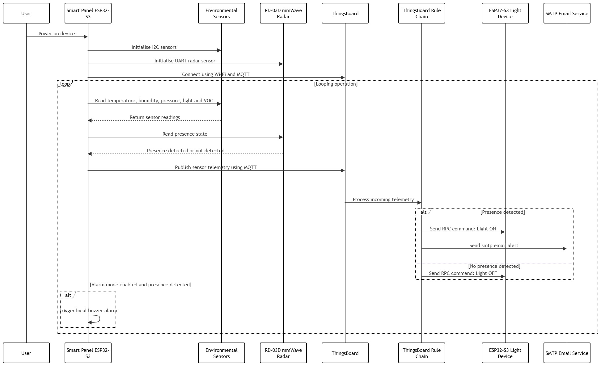

The sequence diagram shows how the Smart Panel communicates with the sensors, mmWave radar, ThingsBoard, the rule chain, the light device, and the SMTP email service. The Smart Panel does not directly control the light. Instead, it sends telemetry to ThingsBoard, and the ThingsBoard rule chain decides whether the light should turn on or off.

---

## Hardware Design

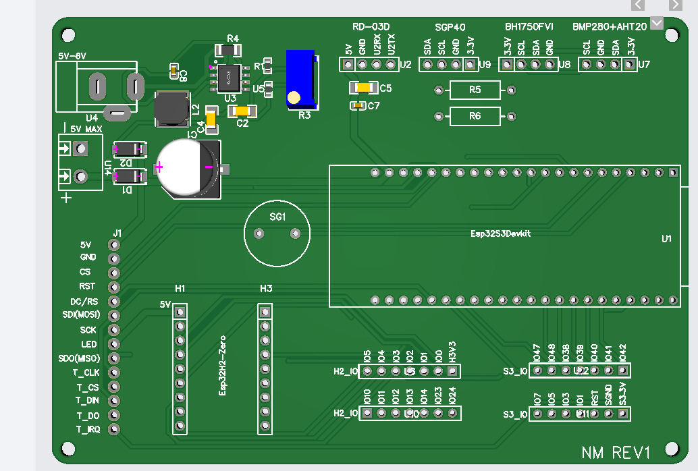

A custom PCB was designed to connect the ESP32-S3, display, sensors, buzzer, buck converter power circuitry, and expansion headers. The PCB helped reduce wiring complexity compared to the early breadboard prototype and made the project closer to a complete embedded system.

### Main Components

| Component | Purpose |
|---|---|
| ESP32-S3 | Main controller for the Smart Panel |
| ESP32-H2 Zero | Matter-over-Thread coprocessor / light device |
| ESP32-C6 | Thread Border Router |
| ILI9488 / ST7796 TFT Touchscreen | Local graphical user interface |
| AHT20 | Temperature and humidity sensing |
| BMP280 | Atmospheric pressure sensing |
| BH1750 | Ambient light sensing |
| SGP40 | Air quality / VOC index sensing |
| RD-03D mmWave Radar | Human presence detection |
| ThingsBoard | IoT dashboard, telemetry storage, alarms, and rule chains |
| ESP32-S3 Light Device | Remote light device controlled using RPC |

### Communication Interfaces

| Protocol | Used For |
|---|---|
| SPI | TFT display and touch controller |
| I2C | AHT20, BMP280, BH1750, and SGP40 sensors |
| UART | RD-03D radar and ESP32-H2 coprocessor communication |
| Wi-Fi | MQTT communication with ThingsBoard |
| Thread | Matter smart home communication |

---

## Software Design

The Smart Panel firmware was designed around a non-blocking service-loop approach. Instead of using long `delay()` calls, the main loop repeatedly updates each subsystem when it is due to run. This keeps the touchscreen responsive while the ESP32-S3 reads sensors, checks the mmWave radar, updates alarm logic, maintains Wi-Fi/MQTT communication, and sends telemetry to ThingsBoard.

The project does not currently use a custom RTOS task structure. Although the ESP32 runs on FreeRTOS internally, the application logic is mainly organised as repeated service functions inside the Arduino `loop()`. This approach kept the prototype easier to develop and debug. A future version could separate the display, sensor reading, MQTT communication, and alarm handling into dedicated FreeRTOS tasks.

The firmware is planned to be modularised into separate files for display handling, sensor services, cloud communication, shared data, configuration, and secrets. This would make the codebase easier to maintain compared to keeping all logic inside one large sketch.

### Firmware Flowchart

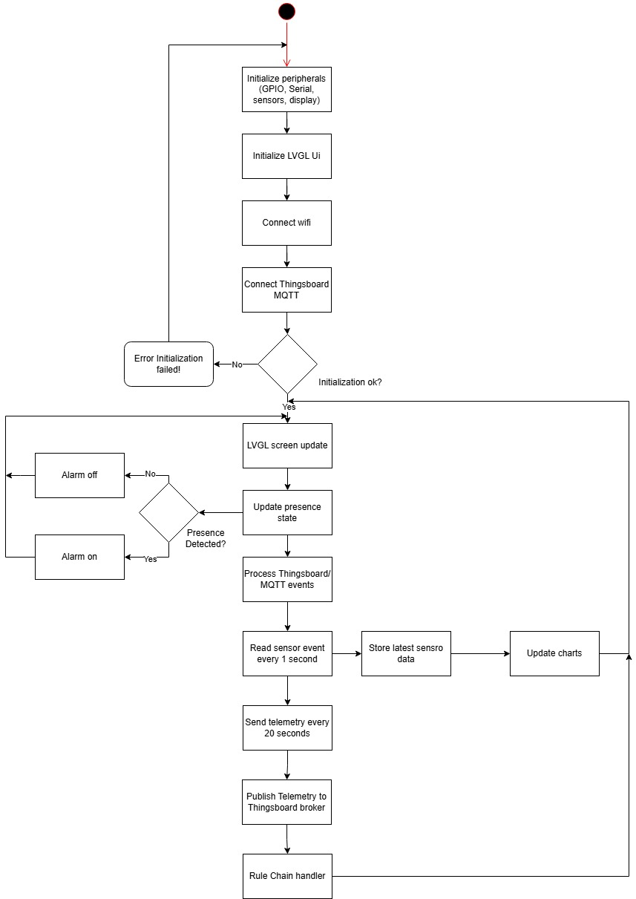

### State Chart

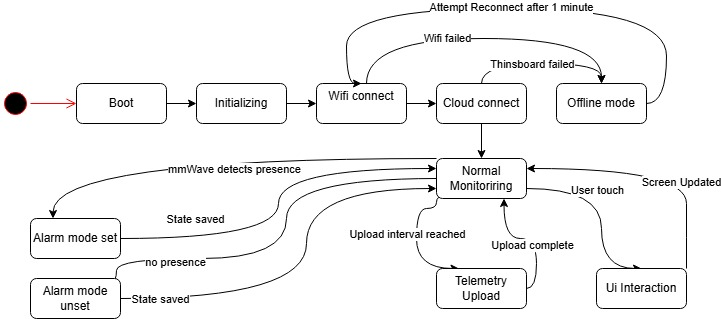

### ThingsBoard Rule Chains

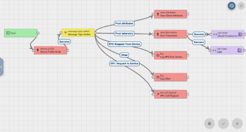

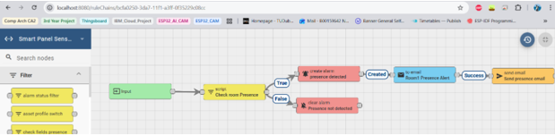

The rule chains handle the cloud-side automation. When the Smart Panel sends new telemetry, ThingsBoard checks the human presence value. If presence is detected, the rule chain can create an alarm, send an email alert, and send an RPC command to turn on the light device. If no presence is detected, the light can be turned off.

---

## Enclosure Design

### Smart Panel Enclosure

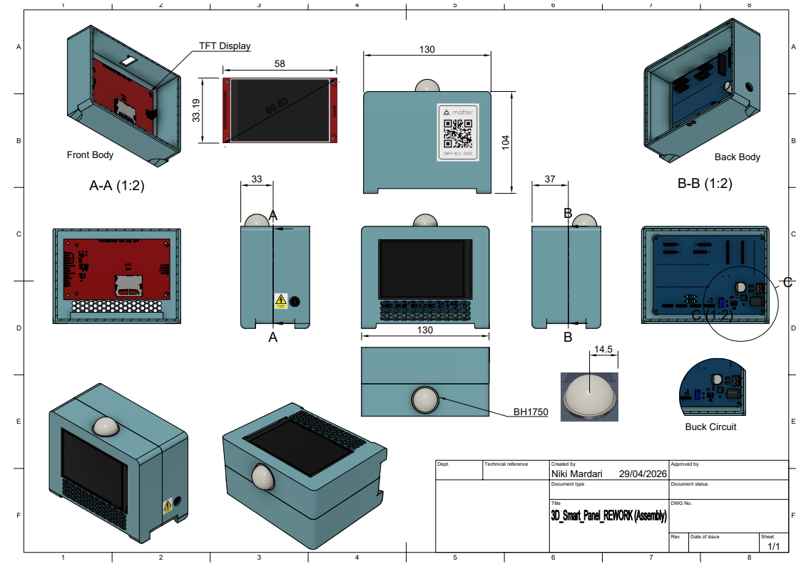

The Smart Panel enclosure was designed to house the touchscreen, ESP32-S3, sensors, radar module, buzzer, and internal wiring. The current enclosure is a prototype and would need further refinement for a more professional or manufacturable version.

### Light / OTBR Enclosure

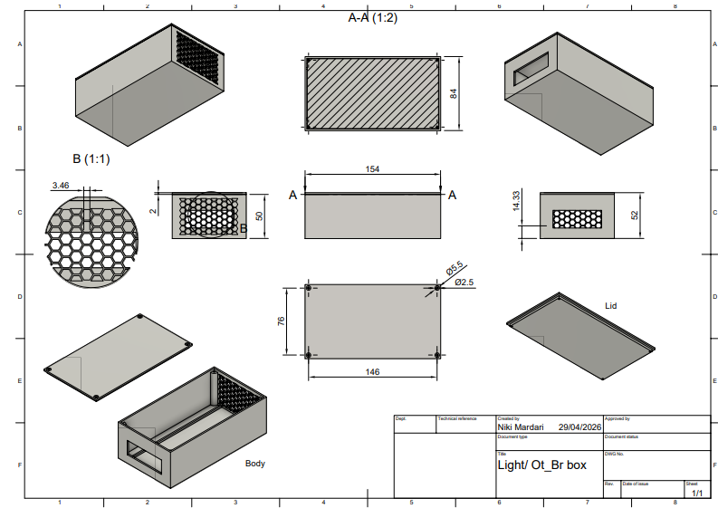

A separate enclosure was designed for the light device and Thread Border Router hardware. This helped separate the main sensor panel from the smart home actuation and Thread testing hardware.

---

## Engineering Reflection and Lessons Learned

This project did not reach every feature that was originally planned, but it successfully demonstrated the main idea: a room-monitoring panel that can detect human presence, display live room conditions, send telemetry to ThingsBoard, trigger alerts, and control a light device through cloud-side automation.

One of the biggest lessons from this project was the importance of power design in embedded systems. During early testing, the display experienced brownouts when multiple peripherals were connected to the ESP32-S3. This was likely caused by current spikes from Wi-Fi activity and the limited current available from the development board’s regulator. To improve stability, a buck converter was added to step down a higher input voltage to a stable 5V rail for the system.

The PCB design stage also showed that hardware problems cannot always be solved in software. After the PCB was manufactured, the slow ramp-up time of the buck converter caused startup issues with the ESP32-S3. This highlighted the need to consider power sequencing, reset behaviour, and startup conditions earlier in the design process.

Key lessons learned from this project include:

- Power supply design is critical when combining displays, sensors, Wi-Fi, and other peripherals.
- Hardware should be tested in stages before integrating the full system.
- PCB design requires careful checking of power rails, reset circuits, and component datasheets.
- A smaller working MVP is better than an unfinished system with too many planned features.
- Cloud automation with ThingsBoard made the project easier to extend without adding too much complexity to the ESP32 firmware.
- Matter and Thread are powerful smart home technologies, but they require more development time than expected.

Overall, this project was a valuable learning experience in embedded systems, IoT communication, PCB design, user interface development, and practical engineering problem solving.
